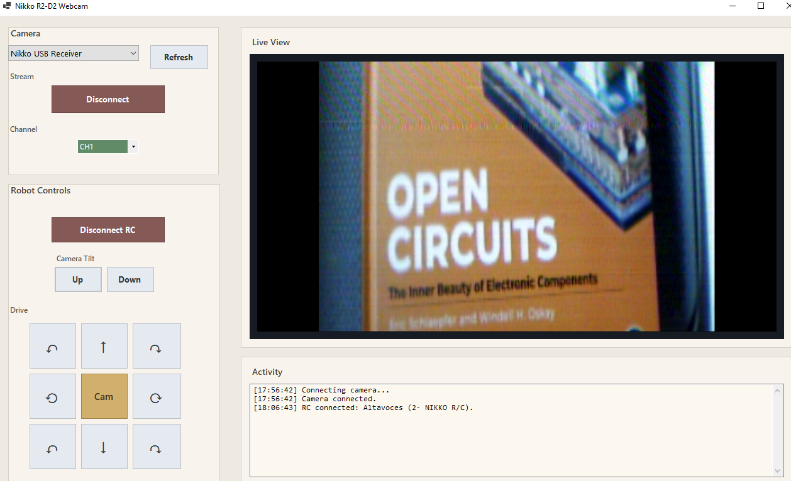

# R2D2.NikkoCam

Windows Forms app for the **Nikko R2-D2 Skype Web Cam** receiver.

Initial version: **0.1.0**

## Why This App Exists

The original Nikko software was built for the Windows XP era and does not work reliably on modern systems such as **Windows 10** and **Windows 11**.

This app exists to keep the robot usable beyond that original XP-only software stack:

- modern .NET / WinForms application
- fixed working camera path for the Nikko receiver
- RC control without depending on the original bundled app
- focused support for the hardware that still works today

This project is a focused replacement for the original XP-era software. It keeps only the working camera and RC path for this hardware.

This is **not** a general webcam app. It is intentionally specialized for the Nikko receiver and the current reverse-engineered behavior.

## Screenshot



## What It Does

- Detects the Nikko video receiver on the WinUSB interface
- Runs the recovered startup control-transfer sequence
- Switches to the streaming alternate setting and reads isochronous video
- Reassembles TM6000 field/line/block records into a live preview
- Downconverts the packed UYVY stream to the original `352`-style display path
- Deinterlaces the preview for a more stable live image
- Sends robot movement/camera commands as DTMF through the receiver's audio endpoint

## Hardware Assumptions

The app is currently hardwired to the known Nikko device identities:

- Video receiver: `VID_6000` / `PID_0001`
- RC audio device: `VID_04D9` / `PID_2821`

For RC audio, the app prefers the endpoint whose Windows property store contains that USB VID/PID. It does not depend on a machine-specific MMDevice GUID.

## Requirements

- Windows
- .NET 9 SDK or runtime
- WinUSB bound to the Nikko video receiver interface
- The Nikko receiver audio endpoint present and enabled for RC features

NuGet dependency:

- `NAudio 2.2.1`

## Install The WinUSB Driver

The app talks to the **video receiver** through WinUSB. If the receiver is still using its original XP-era driver, modern Windows will usually not expose the interface in a way this app can use.

The simplest way to bind WinUSB is with **Zadig**.

### Important

Replace the driver only for the **video receiver interface**.

Do **not** replace the driver for:

- the Nikko audio playback device
- unrelated USB audio devices
- unrelated generic USB devices

The RC controls depend on the receiver still exposing its normal USB audio endpoint.

### Using Zadig

1. Plug in the Nikko receiver.
2. Start Zadig as administrator.
3. Open `Options -> List All Devices`.
4. Find the Nikko video receiver interface.
5. Select `WinUSB` as the target driver.
6. Click `Replace Driver` or `Install Driver`.
7. Unplug and reconnect the receiver after the install finishes.

### How To Pick The Right Device

Look for the receiver interface associated with:

- USB ID `VID_6000` / `PID_0001`

The app itself prefers the WinUSB interface GUID used by the working video path, but the critical part during driver install is binding **the receiver's video interface**, not the audio side.

If Zadig shows multiple entries for the same receiver, prefer the one that corresponds to the **video capture / WinUSB interface**, not the speaker/audio endpoint.

### After Installing

After reconnecting the receiver:

1. open `R2D2.NikkoCam`
2. click `Refresh`
3. confirm the receiver appears in the device list
4. click `Connect`

If the receiver still does not appear, unplug/replug once more and try again.

## Build

From the repository root:

```powershell
dotnet build src\R2D2.NikkoCam\R2D2.NikkoCam.csproj
```

Or with the project-local solution:

```powershell
dotnet build src\R2D2.NikkoCam\R2D2.NikkoCam.sln
```

Output:

```text
src\R2D2.NikkoCam\bin\Debug\net9.0-windows\
```

## Run

```powershell
dotnet run --project src\R2D2.NikkoCam\R2D2.NikkoCam.csproj
```

Or launch:

```text
src\R2D2.NikkoCam\bin\Debug\net9.0-windows\R2D2.NikkoCam.exe
```

For development, you can also open:

```text
src\R2D2.NikkoCam\R2D2.NikkoCam.sln
```

## Controls

### Camera

- `Connect` / `Disconnect`: starts or stops the fixed video path
- `Channel`: sends the recovered `CH1` to `CH4` vendor command pair

### Robot Controls

The drive pad is mapped to DTMF keypad positions:

| Control | DTMF |
| --- | --- |
| Forward-left | `1` |
| Forward | `2` |
| Forward-right | `3` |
| Pivot left | `4` |
| Camera reactivate | `5` |
| Pivot right | `6` |
| Reverse-right | `7` |
| Reverse | `8` |
| Reverse-left | `9` |

Camera tilt:

| Control | DTMF |
| --- | --- |
| Up | `#` |
| Down | `*` |

`Cam` is the original **camera reactivation** function. It is used when the robot is in standby mode and the camera feed must be reawakened.

## Not Supported Yet

- **Lightsaber control is not implemented yet.**

The current app is limited to the verified camera, channel, and RC audio command path. Lightsaber behavior will need separate reverse engineering and implementation.

## Project Layout

### UI

- [`MainForm.cs`](./MainForm.cs)
  - WinForms UI
  - user actions
  - preview display
  - activity log

### Camera Path

- [`NikkoCameraController.cs`](./NikkoCameraController.cs)
  - top-level camera orchestration
  - device discovery
  - startup fallback across compatible interfaces

- [`Video/LabSession.cs`](./Video/LabSession.cs)
  - WinUSB session lifecycle
  - startup sequence execution
  - preview loop
  - channel control writes

- [`Video/Tm6000IsoPacketParser.cs`](./Video/Tm6000IsoPacketParser.cs)
  - isoch packet stream -> TM6000 records

- [`Video/RollingPreviewAssembler.cs`](./Video/RollingPreviewAssembler.cs)
  - record aggregation into the current raster

- [`Video/PreviewFrameBuilder.cs`](./Video/PreviewFrameBuilder.cs)
  - field/block raster build
  - `352` transform
  - preview deinterlace
  - bitmap conversion

- [`Startup/XpLabSupport.cs`](./Startup/XpLabSupport.cs)
  - fixed recovered startup constants and sequence

### RC Audio Path

- [`RobotRcAudioController.cs`](./RobotRcAudioController.cs)
  - RC audio endpoint selection
  - WASAPI output lifecycle
  - DTMF generation

## Design Notes

- The code is intentionally simplified around a **single working hardware path**.
- Old generic preview enums and alternate display modes were removed on purpose.
- Missing video blocks are carried through a persistent raster instead of being painted black immediately.
- The preview is deinterlaced for usability, even though the raw transport is field-based.
- Disconnect/reconnect is implemented as a full WinUSB session teardown and re-open.

## Troubleshooting

### Camera will not connect

Try:

1. unplug and reconnect the video receiver
2. click `Refresh`
3. connect again

If the receiver is not responding to USB control requests, the app will fail before preview start.

### RC controls do not work

Check:

- the receiver audio endpoint is present
- Windows did not switch playback away from the Nikko receiver
- the RC button shows the correct `Connect RC` / `Disconnect RC` state

The app revalidates the RC endpoint, but unplug/replug can still require reconnecting RC manually.

## Status

This project is a practical, hardware-specific application built from reverse engineering and live testing. It is intended to stay small, explicit, and focused on the path that actually works for the Nikko R2-D2 receiver.
